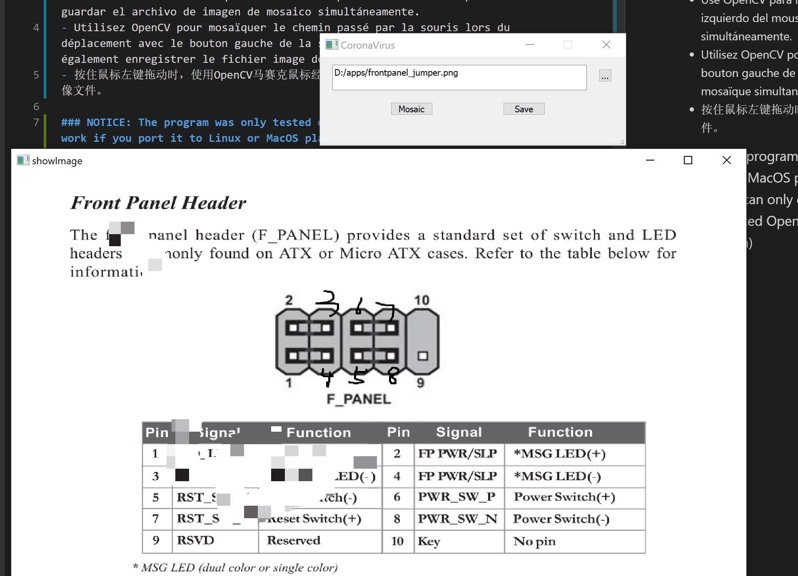

# ChosenMosaic
- Use OpenCV to achieve mosaic on the path passed by the mouse when dragging with the left mouse button pressed down. You can also save the mosaic image file simultaneously.
- Use OpenCV para lograr un mosaico en la ruta pasada por el mouse al arrastrar con el botón izquierdo del mouse presionado. También puede guardar el archivo de imagen de mosaico simultáneamente.
- Utilisez OpenCV pour mosaïquer le chemin passé par la souris lors du déplacement avec le bouton gauche de la souris enfoncé. Vous pouvez également enregistrer le fichier image de la mosaïque simultanément.
- 按住鼠标左键拖动时，使用OpenCV马赛克鼠标经过的路径，也可以同时保存马赛克后的图像文件。

### NOTICE: The program was only tested on Windows platform. It should work if you port it to Linux or MacOS platform. If you compile it without any modification on this project, you can only choose static QT library, Release configuration and C++17, because existed OpenCV libraries are static Release libraries. (i.e. With /MT runtime library option)

